# 毕业论文常见问题检查清单

## 使用方法

本清单是毕业论文中常见的问题汇总，使用本清单的方法如下：
- 仔细阅读清单中的每条规则，准确理解规则含义
- 清单中的大部分规则应该在论文中进行通篇检查
- 清单中的每条规则都检查过后，再把论文发给老师检查

## 检查清单

1. 论文中的所有图片需要添加图片编号和图片标题

| 正确示例 | 错误示例 |
| --- | --- |
| 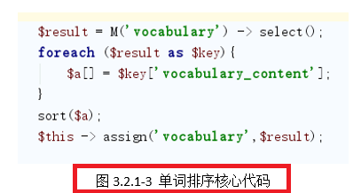 |  |

2. 论文中的代码截图，图片的背景色应该是白色

| 正确示例 | 错误示例 |
| --- | --- |
| 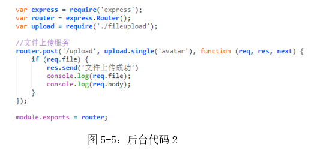 | 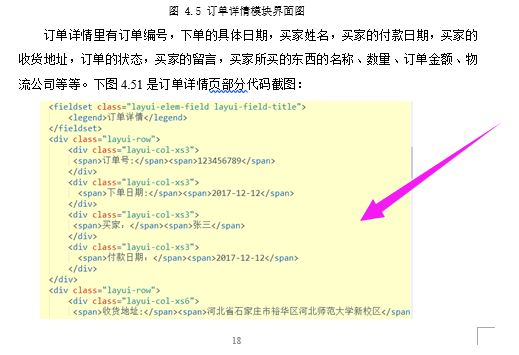 |

3. 论文中设计图（例如：UML 图、流程图，等），图片不应该有背景网格

| 正确示例 | 错误示例 |
| --- | --- |
| 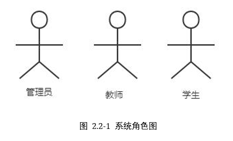 | 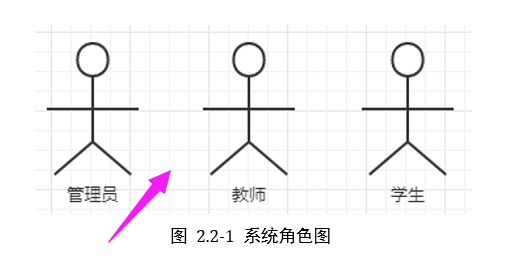 |

4. 论文中的图片应该居中，图片的编号和标题位于图片下方并居中

| 正确示例 | 错误示例 |
| --- | --- |
| 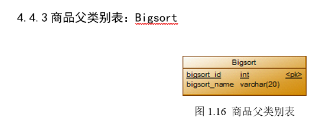 | 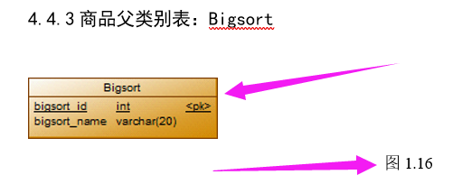 |

5. 论文模板中的格式说明文字不应该出现在论文中

| 正确示例 | 错误示例 |
| --- | --- |
| 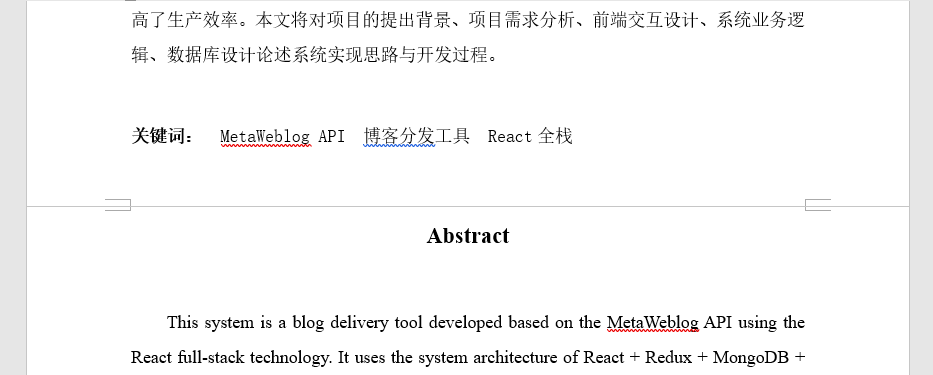 | 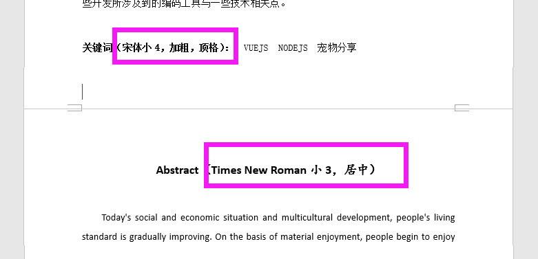 |

6. 正文文字数量不少于 8000 字

| 查看论文字数的方法 |
| --- |
| 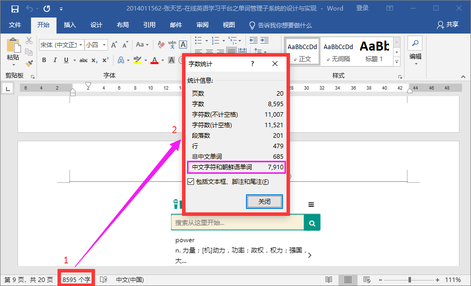 |

7. 毕业论文文件命名规范：`学号-姓名-论文题目`

| 正确示例 | 错误示例 |
| --- | --- |
| 2014011846-白云祥-宠物信息分享平台的设计与实现 | 白云祥-宠物信息分享平台的设计与实现 |

8. 查重论文内容：封面（第二个封皮）、中文摘要、英文摘要、目录、标题、正文、参考文献

| 错误示例 |
| --- |
| 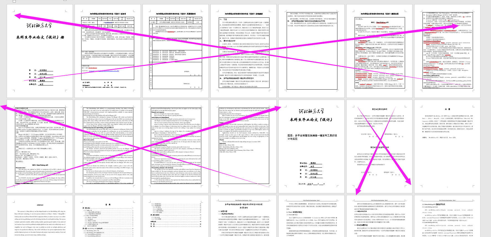 |

9. 表格文字应该跟正文文字格式相同，字体应该是黑色

| 正确示例 | 错误示例 |
| --- | --- |
| 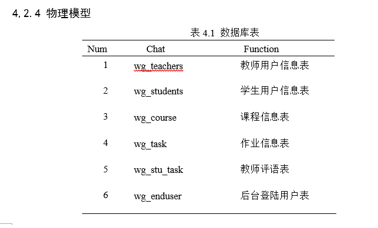 | 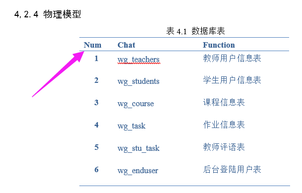 |

10. 表格的列宽应该设置合理，避免内容换行

| 正确示例 | 错误示例 |
| --- | --- |
| 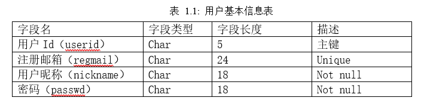 | 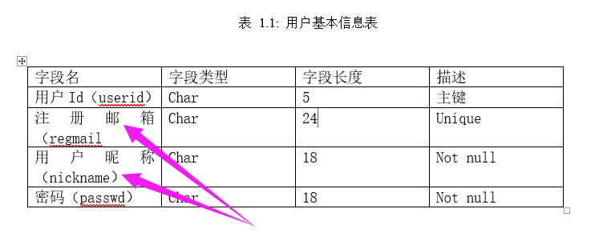 |
