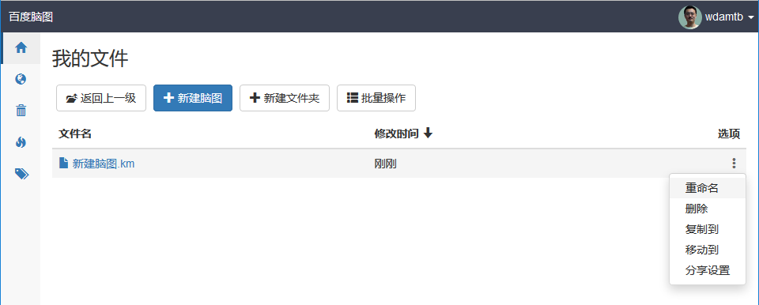
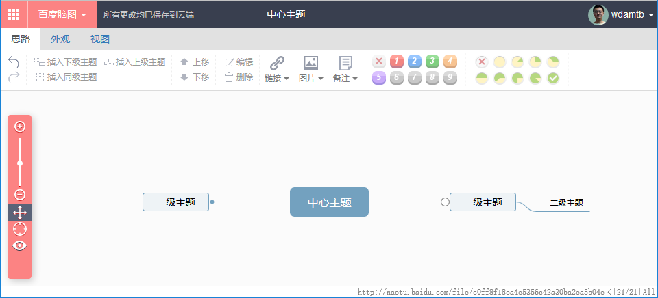

# 15 级实习实训题目

## 题目

在线思维导图工具的设计与实现

## 功能清单

1. 思维导图文件的管理功能，如下图所示，包括：
  - 更改文件名  
  - 创建文件夹  
  - 移动文件  
  - 删除文件  
  - 复制文件  

  

2. 思维导图文件的编辑功能，如下图所示，包括：
  - 添加节点  
  - 删除节点  
  - 复制节点  
  - 更改节点  

## 项目原型

http://naotu.baidu.com

## 参考资料

- kityminder 开源代码：https://github.com/fex-team/kityminder  
- SVG 免费在线课程：https://www.imooc.com/learn/143  
