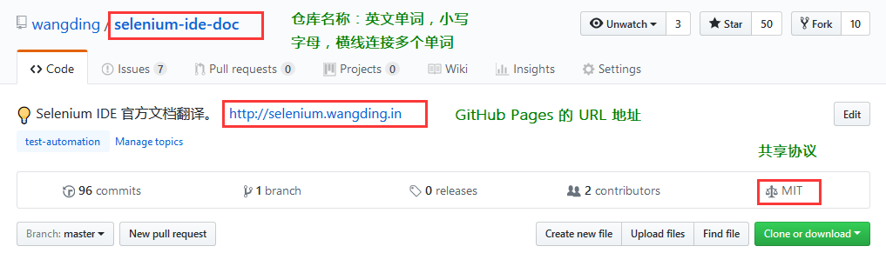

# 项目规范

## 一、代码仓库

创建 GitHub 仓库，放项目的代码和文档，注意事项如下：
  - 将仓库设置为 GitHub 个人首页的第一个仓库，如下图所示：

  - 仓库的命名用有意义的英文单词命名，英文单词全部小写，多个英文单词之间用横线（注意，不是下划线）连接，参考下图；  
  - 仓库根目录放代码，代码的组织根据需要创建相应的目录；  
  - 仓库根目录下的 docs 用来放项目的文档，是否需要放文档，视个人情况而定。如果不放文档，不用建 docs 目录；  

## 二、基本文件

GitHub 仓库要有 README.md 文件，.gitignore 文件和 LICENSE 文件，这三个文件的用法如下：
  - README.md 用来对项目做描述和说明；  
  - .gitignore 文件用来排除不必要的项目文件，或者敏感的信息文件；  
  - LICENSE 文件统一用 MIT 共享协议，参考下图；  

## 三、GitHub Pages

GitHub 仓库需要启用 GitHub Pages 功能，注意事项如下：
  - 程序代码都在 master 分支；  
  - 发布的代码在 gh-pages 分支；
  - GitHub Pages 启用在 gh-pages 分支上；  
  - gh-pages 分支中的代码需要用自动化部署工具进行发布部署前的预处理，例如：压缩，打包合并，等；
  - 仓库描述中请给出 GitHub Pages 的地址，参考下图；

## 四、单元测试

代码需要有自动化单元测试，建议使用 Mocha。

## 五、持续集成

项目需要使用 Travis CI 持续集成工具。
